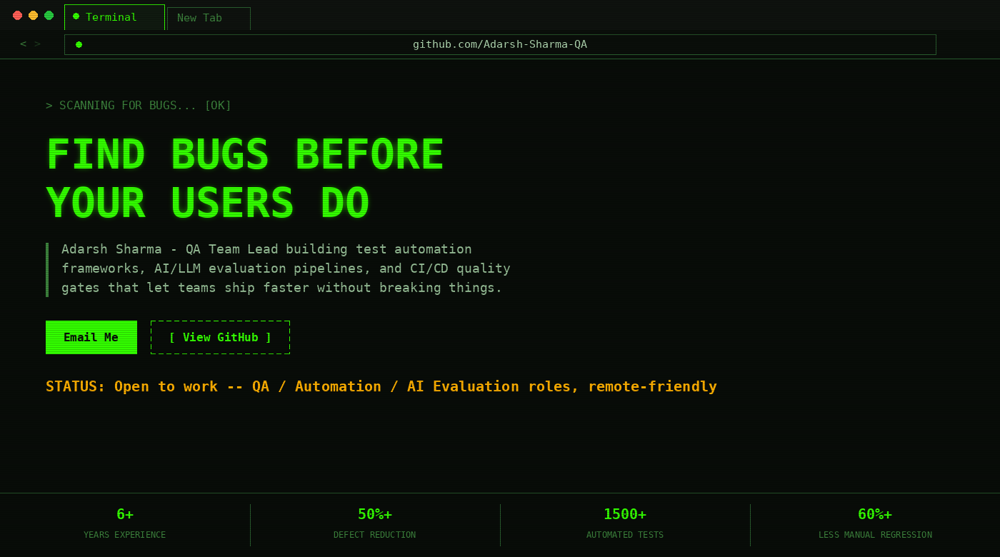

<div align="center">

# Adarsh Sharma
### QA Team Lead · Test Automation · AI Evaluation

*Two views of the same profile — pick whichever vibe you're into. Since GitHub READMEs can't run JavaScript, "switching" works as a native click-to-expand panel below, not a live re-skin — click a mode's title bar to open it.*

<a href="#-visual-mode"></a>
<a href="#-terminal-mode"></a>

</div>

<br/>

<a name="-visual-mode"></a>
<details>
<summary><b>🟡 VISUAL MODE — click to expand</b></summary>

<br/>

<div align="center">


<a href="https://github.com/Adarsh-Sharma-QA">
  
</a>

<br/>


<a href="https://www.linkedin.com/in/adarsh-sharma-qa"></a>
<a href="mailto:adarshqa91@gmail.com"></a>


</div>

<br/>


## 🎯 What I Do

<table width="100%">
<tr>
<td width="50%" valign="top">

### 🧪 Test Automation Frameworks
- Java + Selenium WebDriver frameworks, built framework-first (from zero, not bolted onto an existing codebase)
- Playwright (JavaScript/TypeScript) for modern web UI automation
- Appium for iOS & Android mobile automation
- Robot Framework (Python) — large-scale keyword-driven suites, custom keyword libraries
- BDD with Cucumber, resilient waits/data-seeding to kill flaky tests

</td>
<td width="50%" valign="top">

### 🤖 AI Evaluation & Agentic QA
- LLM/GenAI output evaluation with **DeepEval**
- Agentic, **self-healing automation** using Claude Code via MCP
- Building MCP-aware workflows into existing test suites
- Exploring LangChain/RAG systems as an evaluator, not just a user

</td>
</tr>
<tr>
<td width="50%" valign="top">

### 🔁 CI/CD & Quality Gates
- Jenkins (Groovy pipelines), GitLab CI (YAML), Azure DevOps, CircleCI
- SonarCloud-backed release gates — shipped a team from ad-hoc releases to a steady weekly/bi-weekly cadence
- Grafana dashboards for app & test-environment health
- Docker & Kubernetes for containerized test environments

</td>
<td width="50%" valign="top">

### 📊 QA Strategy & Leadership
- Built a QA function from **zero to production** as a startup's first QA hire (Manual, Automation, Performance, Security)
- Hired, mentored and led automation teams
- Root cause analysis across UI / API / backend
- Cut manual regression effort 60%+ and production defects 50%+ on separate engagements

</td>
</tr>
</table>

<br/>

## 🚀 Current Focus

```text
🔭 Leading QA at KPI (Infithra) — built the entire QA function from scratch
🧠 Building AI/LLM evaluation suites with DeepEval + agentic self-healing automation via Claude Code (MCP)
🌱 Deepening hands-on LangChain / RAG knowledge from the evaluator's seat, not just the builder's
🎯 Looking for my next QA / Automation / AI Evaluation role — remote-friendly
💬 Ask me about: Selenium, Playwright, Appium, Robot Framework, CI/CD quality gates, or testing AI itself
```

<br/>


## 🛠️ Technology Arsenal

**Languages**
<br/>


**Automation & Testing**
<br/>


**AI & Evaluation**
<br/>


**CI/CD & Infrastructure**
<br/>


**Tools**
<br/>


<br/>

## 💡 Expertise Highlights

<table width="100%">
<tr><td width="50%" valign="top">

**🏗️ QA Architecture & Strategy**
- Framework-first automation design (Java/Selenium on Spring Boot, wired to daily scheduled CI runs)
- Release-gate design backed by static analysis (SonarCloud)
- Root cause analysis spanning UI, API and backend
- Manual → Automation → Performance → Security: owned the full QA stack

</td><td width="50%" valign="top">

**🤖 AI-Powered Test Automation**
- LLM/GenAI output evaluation pipelines with DeepEval
- Agentic self-healing automation via Claude Code + MCP
- Treating "testing the AI" as its own discipline, not an afterthought

</td></tr>
<tr><td width="50%" valign="top">

**📱 Mobile & Cross-Platform Automation**
- iOS & Android automation via Appium and Robot Framework
- Custom Python keyword libraries (QR scanning, backend validation)
- Cross-device testing on BrowserStack

</td><td width="50%" valign="top">

**⚙️ CI/CD & Release Engineering**
- Jenkins (Groovy), GitLab CI (YAML), Azure DevOps, CircleCI pipelines
- Containerized test environments with Docker & Kubernetes
- Grafana-based environment health monitoring

</td></tr>
</table>

<br/>

## 🎓 Certifications

- 🧾 AI Evaluation with DeepEval — Udemy
- 🔗 LangChain Framework for Beginners – Build AI Systems + RAG — Udemy
- 📋 Learn Jira with Real-World Examples (+ Confluence) — Udemy
- ☕ Java Programming: Solving Problems with Software
- 🐍 Python: Getting Started with Python
- ⚡ JMeter: Performance Testing with JMeter on Live Apps

<br/>

## 📁 Featured Work

<table width="100%">
<tr><td width="50%" valign="top">

**🔐 Unisecure**
<br/>
Automated Android/iOS flows with Robot Framework and Appium, validating APIs and performance for regulatory compliance.

</td><td width="50%" valign="top">

**🛒 Paper Trade**
<br/>
Led end-to-end testing (UI / API / database) for a $10M B2B e-commerce platform.

</td></tr>
</table>

<br/>


## 📈 GitHub Stats

<div align="center">


<br/>


<br/><br/>


</div>

<br/>

## 🎨 Beyond Code

<table width="100%">
<tr>
<td width="33%" align="center" valign="top">

**✏️ Break-it-first mindset**
<br/>
Poking at the edge cases nobody thought to try

</td>
<td width="33%" align="center" valign="top">

**🛠️ Always tinkering**
<br/>
New automation tools, new AI workflows, same curiosity

</td>
<td width="33%" align="center" valign="top">

**😄 Debugging with a straight face**
<br/>
A flaky test at 6pm builds character

</td>
</tr>
</table>

<br/>

<div align="center">

### 📬 Let's Connect

I'm open to **QA**, **Test Automation** (Selenium / Playwright / Appium / Robot Framework) and **AI Evaluation** roles — remote-friendly.

<a href="mailto:adarshqa91@gmail.com"></a>
<a href="https://www.linkedin.com/in/adarsh-sharma-qa"></a>

<sub>Crafted with precision, tested with paranoia 🧪</sub>


</div>

</details>

<br/>

<a name="-terminal-mode"></a>
<details>
<summary><b>🟢 TERMINAL MODE — click to expand</b></summary>

<br/>

<div align="center">

</div>

<br/>

```text
$ ssh adarsh@github.io
Connecting to github.io... [OK]
Authenticating guest session... [OK]
Loading profile ./adarsh-sharma-qa... [OK]
_
```

```text
+--------------- SYSTEM STATUS ----------------+
| USER       : Adarsh Sharma                   |
| ROLE       : QA Team Lead @ KPI (Infithra)   |
| LOCATION   : Dubai, UAE                      |
| STATUS     : [OK] OPEN_TO_WORK               |
| FOCUS      : QA / Automation / AI Evaluation |
| EXPERIENCE : 6+ yrs (5+ in QA automation)    |
+------------------------------------------------+
```

### `$ automation --list-skills`

```text
SELENIUM            [██████████████████░░] 90%
PLAYWRIGHT          [████████████████░░░░] 80%
APPIUM              [███████████████░░░░░] 75%
ROBOT_FRAMEWORK     [█████████████████░░░] 85%
AI_EVAL/DEEPEVAL    [███████████████░░░░░] 75%
CI_CD_PIPELINES     [█████████████████░░░] 85%
```

### `$ cat experience.log`

```text
[2025-NOW ] KPI (Infithra) :: QA_TEAM_LEAD     :: built QA org from zero; AI self-healing automation
[2022-2024] SDET Tech      :: SDET_II          :: clients: Systech360, Builder_AI, HaulHub
[2021-2022] Qualitest      :: TEST_ENGINEER    :: client: Adobe
[2017-2018] Aisin          :: ENGINEER_TRAINEE :: clients: Maruti_Suzuki, Toyota
```

### `$ automation --help`

```text
  --selenium          Java WebDriver automation frameworks
  --playwright         JS/TS UI automation
  --appium              iOS & Android mobile automation
  --robotframework        Python keyword-driven suites (1500+ cases)
  --deepeval                LLM / GenAI output evaluation
  --mcp                       Agentic self-healing automation (Claude Code)
  --ci  jenkins,gitlab-ci,azure-devops,circleci
  --infra  docker,kubernetes,grafana,sonarcloud
```

### `$ cat certifications.log`

```text
[OK] AI Evaluation with DeepEval             -- Udemy
[OK] LangChain for Beginners (RAG systems)   -- Udemy
[OK] Jira with Real-World Examples           -- Udemy
[OK] Java Programming: Solving Problems
[OK] Python: Getting Started
[OK] JMeter: Performance Testing
```

### `$ cat projects.log`

```text
[Unisecure]   Automated Android/iOS flows (Robot Framework + Appium) for regulatory compliance
[Paper Trade] End-to-end QA (UI/API/DB) for a $10M B2B e-commerce platform
```

<br/>

<div align="center">


<br/><br/>


</div>

### `$ contact --list`

```text
$ contact --email
> adarshqa91@gmail.com

$ contact --linkedin
> linkedin.com/in/adarsh-sharma-qa

$ status --current
> OPEN_TO_WORK :: QA / Automation / AI_Evaluation roles, remote-friendly
_
```

<div align="center">

<a href="mailto:adarshqa91@gmail.com"></a>
<a href="https://www.linkedin.com/in/adarsh-sharma-qa"></a>

<sub>// EOF — thanks for reading the source</sub>

</div>

</details>
